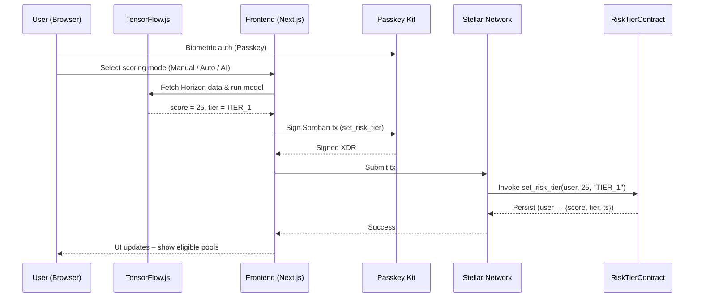

# riskon – An On-Chain Credit Scoring System for Undercollateralized Lending

_Stellar / Soroban • Passkey • TensorFlow.js • Next.js_

> **Disclaimer:** `riskon` provides an AI-predicted credit score based on on-chain data. This score is for informational purposes only and does not constitute financial, investment, or credit advice. All financial decisions carry risk, and users should conduct their own research.

---

## Table of Contents

- [riskon – An On-Chain Credit Scoring System for Undercollateralized Lending](#riskon--an-on-chain-credit-scoring-system-for-undercollateralized-lending)
  - [Table of Contents](#table-of-contents)
  - [Problem Statement](#problem-statement)
  - [Solution Overview](#solution-overview)
  - [Core Principles](#core-principles)
  - [Architecture](#architecture)
    - [Technology Stack](#technology-stack)
    - [High-Level Flow](#high-level-flow)
    - [Smart Contract – `RiskTierContract`](#smart-contract--risktiercontract)
  - [Risk Scoring Model](#risk-scoring-model)
    - [Scoring Options](#scoring-options)
    - [Tier Mapping (0-100)](#tier-mapping-0-100)
    - [From Score to Strategy: Building On-Chain Reputation](#from-score-to-strategy-building-on-chain-reputation)
  - [User Journey](#user-journey)
  - [Getting Started](#getting-started)
    - [Prerequisites](#prerequisites)
    - [Local Dev \& Test](#local-dev--test)
    - [Deploy to Stellar Testnet](#deploy-to-stellar-testnet)
  - [MVP Checklist](#mvp-checklist)
  - [Hackathon Fit](#hackathon-fit)
    - [Judging Criteria Alignment](#judging-criteria-alignment)
  - [Roadmap](#roadmap)
  - [Contributing](#contributing)
  - [License](#license)
  - [Disclaimer](#disclaimer)

---

## Problem Statement

Decentralised finance still suffers from **information asymmetry**:

| Conventional Finance (CeFi)                                   | DeFi Today                                                           |
| ------------------------------------------------------------- | -------------------------------------------------------------------- |
| Credit bureaus (FICO, KKB) quantify borrower risk.            | **No native, standardised risk layer**.                              |
| Capital-efficient (under-collateralised) lending is possible. | **Over-collateralisation** dominates – capital is locked & idle.     |
| Borrowers build reputation and obtain better terms.           | Every address faces **uniform terms** regardless of history.         |
| Lenders price products by risk bands.                         | Risky & safe protocols blend together – new users cannot judge risk. |

**Outcome:** DeFi capital is inefficient, user experience is intimidating, and protocol safety is opaque.

---

## Solution Overview

`riskon` introduces a **transparent, on-chain credit scoring system** for the Stellar ecosystem. It analyzes on-chain behavior to generate a **privacy-preserving credit score (0-100)**, which is then recorded on the blockchain. This score maps to **risk tiers (`TIER_1` to `TIER_3`)**, creating a foundational layer that any protocol can query to enable more sophisticated financial products, including undercollateralized lending.

**Benefits:**

- **Borrowers:** Can leverage a strong on-chain history to access more favorable terms, potentially including lower collateral requirements.
- **Lenders / Protocols:** Can build more capital-efficient systems by segmenting users based on AI-predicted creditworthiness, enhancing risk management.
- **Ecosystem:** Establishes a standardized, composable credit layer, fostering innovation and trust in Stellar DeFi.

---

## Core Principles

| Principle                     | Implementation                                                                                                                                                   |
| ----------------------------- | ---------------------------------------------------------------------------------------------------------------------------------------------------------------- |
| **Speed & Cost Matter**       | Stellar settles in seconds for < $0.01 – perfect for frequent score reads/writes.                                                                                |
| **Scalability**               | Soroban's Wasm runtime & Rust make managing millions of user scores feasible.                                                                                    |
| **UX First**                  | Passkey login (Face ID / fingerprint) removes seed-phrase friction & phishing risk.                                                                              |
| **Privacy by Default**        | TensorFlow.js runs the ML model **client-side**. Wallet data never leaves the browser; only the final numeric score is stored on-chain.                          |
| **Composable Money-Lego**     | `RiskTierContract` is an open, reusable primitive that other Stellar dApps can integrate for credit assessment.                                                  |
| **Informational, Not Advice** | The generated score is an AI-driven prediction based on historical data and is not financial advice. It serves as one data point among many for risk assessment. |

---

## Architecture

### Technology Stack

| Layer                      | Tech                                        | Rationale                                                                              |
| -------------------------- | ------------------------------------------- | -------------------------------------------------------------------------------------- |
| **Blockchain & Contracts** | **Stellar** + **Soroban SDK** (Rust → Wasm) | Fast, cheap, Wasm-native, account-abstraction friendly.                                |
| **Smart Wallet**           | **Passkey** (WebAuthn)                      | Zero-friction biometrics; hardware-isolated keys; enables Stellar account abstraction. |
| **Risk Analytics**         | **TensorFlow.js**                           | Runs in the user's browser for full data privacy; no backend handles PII.              |
| **Frontend**               | **Next.js (React)**                         | Modern DX; server/client split via App Router; partial SSR for speed.                  |
| **Liquidity Monitor**      | Node.js / Rust service (off-chain)          | Optional: streams market data used by the **AI-Enhanced** scoring mode.                |

### High-Level Flow



### Smart Contract – `RiskTierContract`

The on-chain heart of `riskon`, written in Rust using the Soroban SDK. Its primary function is to store and serve a `RiskTierData` struct for each user address, containing their AI-predicted credit score and corresponding tier. This system is designed to be a neutral, informational primitive for the DeFi ecosystem.

**Key Storage:**
The contract stores a `RiskTierData` struct for each user address:

```rust
#[derive(Clone, Debug, Eq, PartialEq)]
pub struct RiskTierData {
    pub score: u32,          // 0-100 risk score
    pub tier: Symbol,        // TIER_1, TIER_2, or TIER_3
    pub timestamp: u64,      // Unix timestamp
    pub chosen_tier: Symbol, // User's chosen tier for operations
}
```

**Key Functions:**

- `set_risk_tier(env, user, score, tier, chosen_tier)`: Writes or updates a user's risk profile to the Stellar ledger. Can only be called by an authorized source or the user themselves.
- `get_risk_tier(env, user)`: Retrieves the full risk data for a given user.
- `can_access_tier(env, user, target_tier)`: The core logic gate. Any dApp can call this function to check if a user is eligible for a specific risk tier based on their score. The logic is as follows:
  - `TIER_1` (Low Risk): Accessible if `score <= 30`.
  - `TIER_2` (Medium Risk): Accessible if `score <= 70`.
  - `TIER_3` (High Risk): Accessible by everyone (`true`).

This model ensures that access to different risk tiers is governed by a transparent, on-chain metric, allowing protocols to build their own custom logic on top of this foundational credit score.

---

## Risk Scoring Model

At the core of our system is a **TensorFlow.js model** that functions as an AI-powered prediction engine. We chose TensorFlow.js specifically because it allows complex data analysis to run entirely within the user's browser. This is a critical privacy feature: raw wallet data is fetched from the Horizon API directly into the browser, processed locally, and is never sent to our servers. Only the final, anonymized 0-100 score is used to create the blockchain transaction.

### Scoring Options

| Mode                       | Target User                                 | Data Source                                                                                                                                                | Notes                                                                                                           |
| -------------------------- | ------------------------------------------- | ---------------------------------------------------------------------------------------------------------------------------------------------------------- | --------------------------------------------------------------------------------------------------------------- |
| **Manual Input**           | New wallets or privacy-sensitive users      | Self-reported data points (transaction count, frequency, etc.)                                                                                             | Provides a baseline score; less accurate than automated analysis.                                               |
| **Automated Credit Score** | Wallets with on-chain history               | Horizon API metrics:• Wallet age & tx count• Lending/borrowing interactions• Repayment & liquidation history• Protocol diversity & risk level• Current LTV | Runs 100% in the user's browser for maximum privacy. The AI predicts a score based on these historical metrics. |
| **AI-Enhanced**            | Power users seeking the most accurate score | Automated metrics + real-time market feeds (liquidity, volatility)                                                                                         | Consumes data from the off-chain liquidity-monitor service for a more nuanced prediction.                       |

### Tier Mapping (0-100)

The AI-predicted score maps to one of three tiers. This mapping is for informational purposes, allowing protocols to segment users.

| Score  | Tier     | Label       | General Interpretation                                                |
| ------ | -------- | ----------- | --------------------------------------------------------------------- |
| 0-30   | `TIER_1` | Low Risk    | Indicates a history of responsible on-chain behavior.                 |
| 31-70  | `TIER_2` | Medium Risk | Indicates a standard on-chain history with moderate activity.         |
| 71-100 | `TIER_3` | High Risk   | May indicate a newer address or highly leveraged on-chain activities. |

### From Score to Strategy: Building On-Chain Reputation

`riskon` provides a transparent metric that allows users to understand how their on-chain actions translate into a credit score. By engaging in responsible financial activities—such as timely repayments or maintaining healthy collateralization ratios—users can positively influence their score over time.

This creates a positive feedback loop: responsible on-chain behavior leads to a better credit score, which can unlock access to more favorable terms within the DeFi ecosystem. The platform does not provide specific advice, but rather empowers users by making the cause-and-effect relationship between actions and on-chain reputation transparent.

---

## User Journey

1.  **Passkey Login:** 1-tap biometric authentication, no seed phrase required.
2.  **Choose Scoring Mode:** User selects Manual, Automated, or AI-Enhanced.
3.  **Local Analytics:** The TensorFlow.js model computes the score securely inside the browser.
4.  **Soroban Tx Build:** A transaction to call `set_risk_tier` is prepared with the new score and tier.
5.  **Biometric Signature:** The user signs the transaction with their Passkey; the private key never leaves the secure hardware of their device.
6.  **Tx Submission:** The transaction is confirmed on the Stellar Testnet in 3-5 seconds.
7.  **Dynamic UI:** The frontend queries `can_access_tier` to dynamically enable or disable actions on different liquidity pools.

---

## Getting Started

### Prerequisites

- Rust ≥ 1.78 + `wasm32-unknown-unknown` target
- Soroban CLI ≥ 24.0.0
- Node.js ≥ 20, pnpm ≥ 9
- macOS / Linux / WSL; Docker is optional for running services.

### Local Dev & Test

```bash
# Clone the repository
git clone https://github.com/riskon-labs/riskon.git
cd riskon

# Build and test contracts
cargo build --target wasm32-unknown-unknown --release
soroban test               # Run unit tests

# Run the frontend application
cd frontend # or your frontend directory
pnpm install
pnpm dev                   # Starts on http://localhost:3000
```

### Deploy to Stellar Testnet

Set the required environment variables for the frontend:

```bash
NEXT_PUBLIC_HORIZON=https://horizon-testnet.stellar.org
NEXT_PUBLIC_RISKTIER_CONTRACT_ID=<your_deployed_contract_id>
```

Deploy the contract:

```bash
soroban contract deploy \
  --wasm target/wasm32-unknown-unknown/release/risktiercontract.wasm \
  --network testnet \
  --source <your_issuer_secret_key>

# Copy the resulting CONTRACT_ID into your .env file
```

---

## MVP Checklist

- [x] Public GitHub repo with this detailed README.
- [x] `RiskTierContract` deployed to the Stellar Testnet.
- [x] Next.js demo app with Passkey authentication and score computation.
- [x] 100% of contract logic written in Rust using the Soroban SDK.

---

## Hackathon Fit

- **Hack DeFi & Infra:** We are building a composable on-chain credit layer—a foundational "money lego" for other protocols to build capital-efficient applications.
- **Hack Consumer dApps:** We deliver a frictionless Passkey-based UX and a clear, intuitive credit score dashboard for end-users.
- **Bonus Criterion:** We fully achieve the goal of "smart wallets on Stellar authenticated using passkeys."

### Judging Criteria Alignment

| Category                     | How `riskon` Meets It                                                                                    |
| ---------------------------- | -------------------------------------------------------------------------------------------------------- |
| **Meaningful Idea**          | Tackles a universal DeFi pain point: trust, risk, and collateral inefficiency.                           |
| **Technical Implementation** | Deployed on Testnet; uses Passkey & Soroban; architected to be Launchtube-ready for gas sponsorship.     |
| **User Experience**          | Seed-phrase-free onboarding; 3-click scoring process; simple tier badges and gated UI.                   |
| **Ecosystem Fit**            | Leverages Soroban, Horizon, and Passkey Kit; contributes a reusable risk contract back to the ecosystem. |
| **Presentation & Docs**      | Detailed README, clear flowcharts, and well-commented code.                                              |

---

## Roadmap

| Phase                  | Milestone                                                                                         |
| ---------------------- | ------------------------------------------------------------------------------------------------- | ----------------------------------------------------------------------------------------------------------------------------------------------- |
| **v1 (Hackathon MVP)** | Testnet deployment, 3 scoring modes, tier-gated liquidity pool explorer.                          |
| **v1.1**               | Launchtube integration for a gasless user experience; mainnet pilot with a partner protocol.      |
| **v2**                 | DAO-governed model updates; reputation-based NFTs; cross-chain score oracle (e.g., via Wormhole). |
| **v3**                 | Launching native under-collateralised lending markets powered by `riskon` tiers.                  |
| **v4**                 | **Risk-as-a-Service (RaaS) API**                                                                  | Develop a B2B API allowing other Stellar protocols to integrate `riskon` scoring directly for their own underwriting and risk management needs. |

---

## Contributing

1.  Fork the repository and branch from `main`.
2.  Commit sign-offs are required (`git commit -s`).
3.  Run `pnpm lint && cargo fmt && cargo test` to ensure code quality.
4.  Submit a Pull Request to the `dev` branch, describing your changes and linking to any relevant issues.

---

## License

`riskon` is released under the MIT License. See the `LICENSE` file for the full text.

---

## Disclaimer

The `riskon` credit score is an AI-generated prediction based on past on-chain activity and is provided for informational purposes only. It is not financial, investment, or credit advice. The score does not guarantee any specific outcomes, and all financial activities involve risk. Users should always conduct their own research and due diligence before engaging in any transactions.
